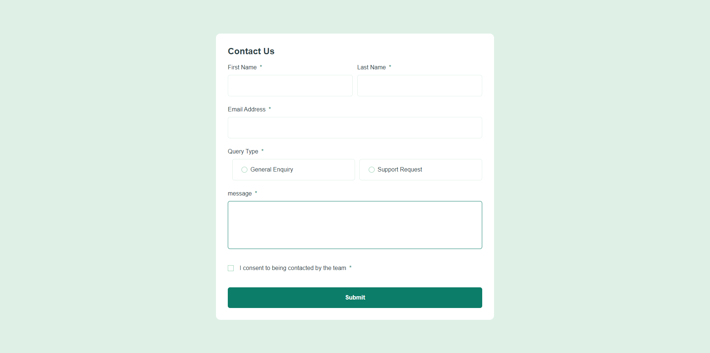
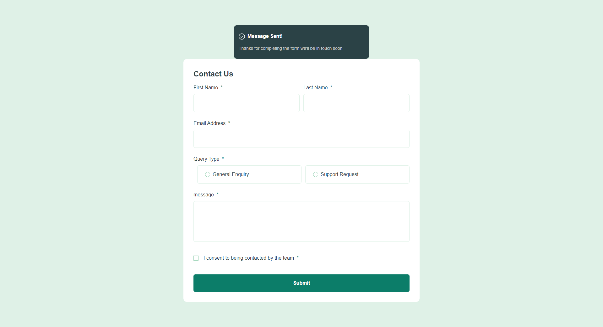
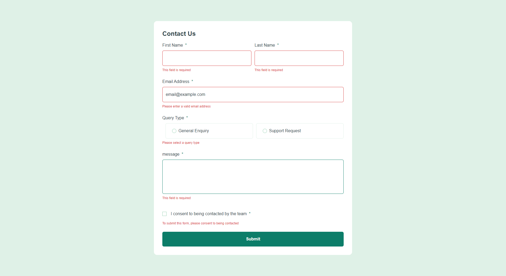

# Frontend Mentor - Contact Form Solution

This is a solution to the [Contact Form challenge on Frontend Mentor](https://www.frontendmentor.io/challenges/contact-form-58d9d0ac7ed74225b7a1a81e).

## Table of contents

 - [Overview](#overview)
    - [The challenge](#the-challenge)
    - [Screenshot](#screenshot)
    - [Links](#links)
 - [My process](#my-process)
    - [Built with](#built-with)
    - [What I learned](#what-i-learned)
    - [Continued development](#continued-development)
    - [Useful resources](#useful-resources)
 - [Author](#author)
 - [Acknowledgments](#acknowledgments)

## Overview

This is a simple contact form that is responsive on all devices. It is built with React and styled with Tailwind Css. The form is validated using custom react validation and a custom validation message is displayed when the form is submitted.
It is follows the WCAG guidelines for accessibility. This involves using semantic HTML when possible and ARIA.

### The challenge

> Users should be able to :
- Complete the form and see a success toast message upon successful submission
- Receive form validation messages if: 
  - A required field has been missed or is empty   
  - The email address is not formatted correctly
- Complete the form using only their keyboard
- Have inputs, error messages, and the success message announced on their screen reader
- View the optimal layout for the interface depending on their device's screen size
- See hover and focus states for all interactive elements on the page

### Screenshot

### Links
- Solutionn URL : [Github Repo](https://github.com/Erhahon-Imafidon/contact_form)
- Live Site URL : [Live Site](https://contact-form-five-ruby.vercel.app/)

## My Process

### Built with

- Semantic HTML5 markup
- Tailwind CSS
- Mobile First workflow
- Flexbox
- [React](https://reactjs.org/) - JS library
- [Vite](https://vitejs.dev/) - Build tool for modern web development

### What I Learned
> I Learned how state managment actually works
> How and when to use useEffect and useState hooks
> How to update an object Array works without using non-mutating methods like map, filter, reduce etc. 
> I reinforced my knowledge of Tailwind CSS and how to use it to style a webpage and it mobile first workflow

### Useful resources

- [React Documentation](https://reactjs.org/docs/getting-started.html) - This helped me understand how to use React and its hooks
- [Managing State on React.dev](https://react.dev/learn/managing-state) - This article helped me understand how state management works in React and how to use the useState and useEffect hooks

## Author

- Frontend Mentor - [@Erhahon-Imafidon](https://www.frontendmentor.io/profile/Erhahon-Imafidon)
- X - [@ErhahonImafidon](https://x.com/ImafidonErhahon)

